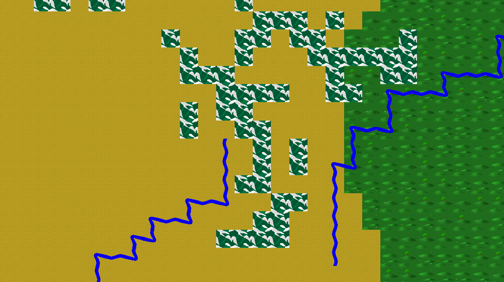

# Emiriusu Engine
The Emiriusu Engine is an old school Windows and Linux 2D game engine for strategic games written in C++ with SFML libraries. The Engine (and the example game we are making) will provides displaying graphics and animations, generating a random world, playing music and sounds, old school interface, many typical strategic mechanics, Artificial intelligence and online multiplayer.

We are constantly adding new features to the engine and patching up bugs. The engine an the game will be available for free.


  

## Features
- Generating a random world
- Displaying single textures and tileSet textures
- Army mechanics
- Support for layers and transparecy

## Getting started
Prerequisites:
- We suggest Windows 10, version 1803 or newer (we have tested on such systems).
- Install the latest version of [Visual Studio](https://developer.microsoft.com/en-us/windows/downloads) (the free community edition is sufficient).
  - Install the "Desktop development with C++" workload.
  - Install the optional "C++ Universal Windows Platform tools" component.
  - Install the latest Windows 10 SDK.

  
- Download the [SFML libraries](https://www.sfml-dev.org/download/sfml/2.5.1/) for Visual Studio (x64).

- Get the code:
    ```
    git clone https://github.com/ViktusYT/Emiriusu.git
    ```

- Open [Emiriusu.sln](Emiriusu.sln) in Visual Studio to build and run the Engine.

## Contributing
Want to contribute? We are very happy that you want to help us.

If Emiriusu is not working properly or you find a bug, please [submit issue on GitHub](https://github.com/ViktusYT/Emiriusu/issues).

## Roadmap
Emiriusu is under active development by Kisah Games

Now the Emiriusu team is focused on:
- Create a user interface
- Create a basics mechanics
- Optimize the engine operation
- Create a cities mechanics
- Create AI
- Improve the sampling rates

## License
Copyright (c) Wiktor Ogrodnik. All rights reserved.

Licensed under the [MIT License](./LICENSE).
